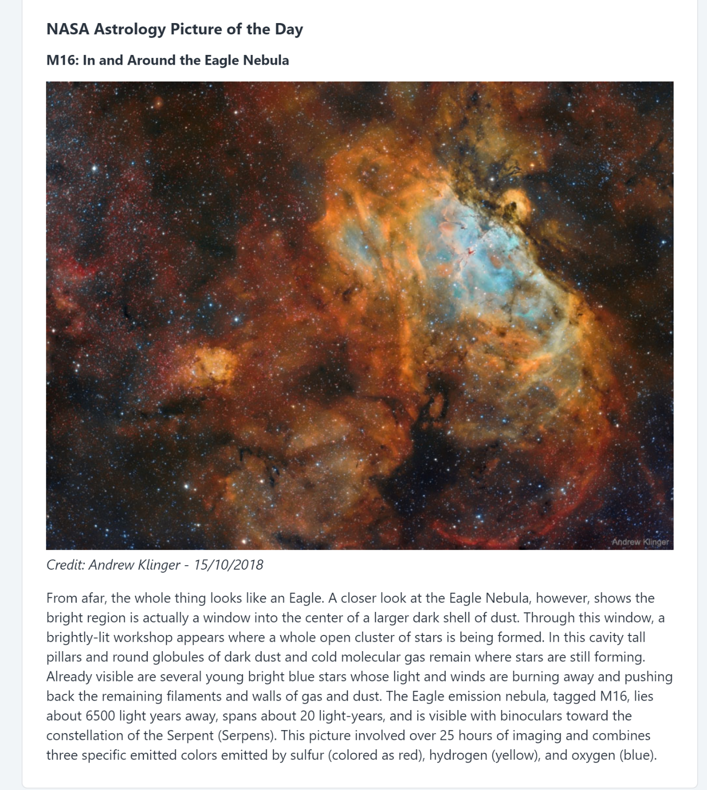
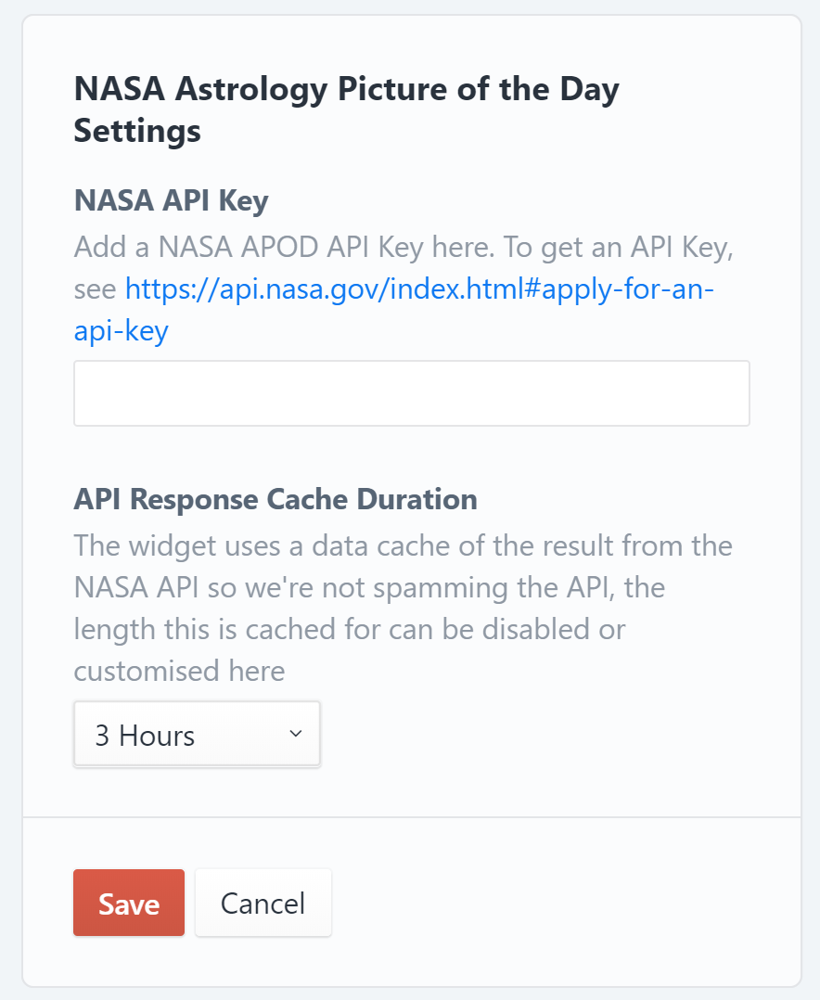

# NASA Astrology Astrology Picture of the Day widget plugin for Craft CMS 3.x
Adds a simple widget which pulls the NASA Astrology Picture of the Day in to the admin dashboard

## Requirements

This plugin requires Craft CMS 3.0.0-beta.23 or later.

## Installation

To install the plugin, follow these instructions.

1. Open your terminal and go to your Craft project:

        cd /path/to/project

2. Then tell Composer to load the plugin:

        composer require adampatpattison/craft-nasaapod

3. In the Control Panel, go to Settings → Plugins and click the “Install” button for NASA Astrology Astrology Picture of the Day widget.

## NASA Astrology Astrology Picture of the Day widget Overview
This plugin, adds a simple widget which pulls the NASA Astrology Picture of the Day in to the admin dashboard. It requires the user to generate an API Key from the NASA API website and support caching the API calls so as not to spam the API.

## Using NASA Astrology Astrology Picture of the Day widget

To get an API Key, visit [https://api.nasa.gov](https://api.nasa.gov/index.html#apply-for-an-api-key) and add a valid email address to receive your key.
Once completed, you can add your API key to the widget settings once the plugin is enabled and added via the dashboard control.

There is also a data caching option which is enabled by default but can be customised. This is to reduce the amount of calls made to the API.

Brought to you by [Adam Pat Pattison](https://www.adampatpattison.co.uk)
